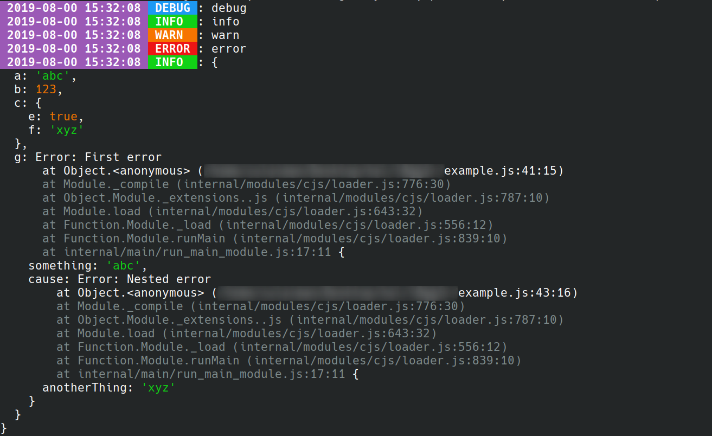

# l0gg3r

Minimalistic logging library for javascript.

## Install

```
npm install l0gg3r
```

## Usage

### Basic logger

```js
const logger = require("l0gg3r")();

logger.info("hello");
```

Output:

```json
{"level":20,"timestamp":1567945561139,"message":"hello"}
```

### Full option logger

```js
const { resolve } = require("path");
const { hostname } = require("os");
const l0gg3r = require("l0gg3r");

const { transports, serializers } = l0gg3r;

let logger;

if(process.env.NODE_ENV === "production"){
  logger = l0gg3r({
    transports: [
      transports.consoleTransport({
        level: "info",
        serializer: serializers.json({
          redact: ["message.c", "message.f.*"],
          meta: {
            pid: process.pid,
            hostname: hostname()
          }
        })
      })
    ]
  });
} else {
  logger = l0gg3r({
    transports: [
      transports.consoleTransport({
        level: "debug",
        serializer: serializers.prettyConsole()
      }),
      transports.fileTransport({
        level: "debug",
        serializer: serializers.prettyFile(),
        file: resolve(__dirname, "./debug.log")
      }),
      transports.fileTransport({
        level: "error",
        serializer: serializers.prettyFile(),
        file: resolve(__dirname, "./error.log")
      })
    ]
  });
}
```

## Redact

Using [`fast-redact`](https://github.com/davidmarkclements/fast-redact) for redactions. Look at its paths options to know what you can pass.

## Meta

An object that will be joined with the log object.

## Levels

```js
const levels = {
  debug: 10,
  info: 20,
  warn: 30,
  error: 40
};
```

## prettyConsole



## Custom transports and serializers

A brief look at the code should tell you how to make them.

## Note

Don't use multiple transports in production.
